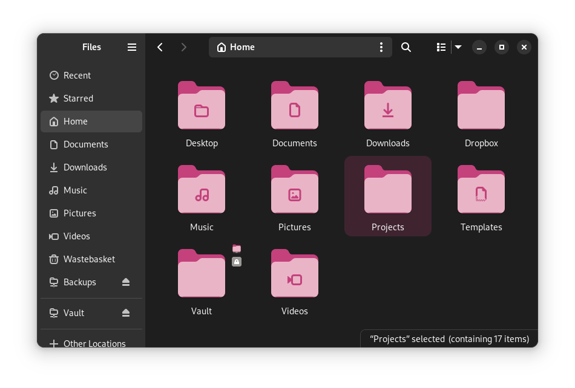

<header class="article-header">
    <h1>Purple Adwaita Folders</h1>
    Published <time datetime="2024-03-27">2024-03-27</time> by James Frost.
    <p class="tagline">A small icon theme to get some nice purple folders on GNOME.</p>
</header>

The [Gradience program](https://github.com/GradienceTeam/Gradience) can be used to change most of the shell's colours, but unfortunately cannot change the folders. Thus this small icon theme.

[Download the AdwaitaPurpleFolders icon theme here](AdwaitaPurpleFolders.tar.gz), and extract the tar file to `~/.local/share/icons`. Then change the icon theme in GNOME Tweaks.



The standalone colour (`@accent_colour`) is `#c4417c`
The background colour (`@accent_bg_color`) is `#a23666`

The icon colours have been generated by keeping the OKLCH lightness and chroma the same as the original, but changing the hue to 356.32°. The sole exception is that `#438de6` can been directly replaced with the standalone colour, for consistency; it was pretty close anyway.

Colour substitutions from base Adwaita icons:

```sed
s/#438de6/#c4417c/g
s/#62a0ea/#da7a9f/g
s/#afd4ff/#f8bdd1/g
s/#c0d5ea/#e8c9d3/g
s/#a4caee/#e9b4c6/g
```
